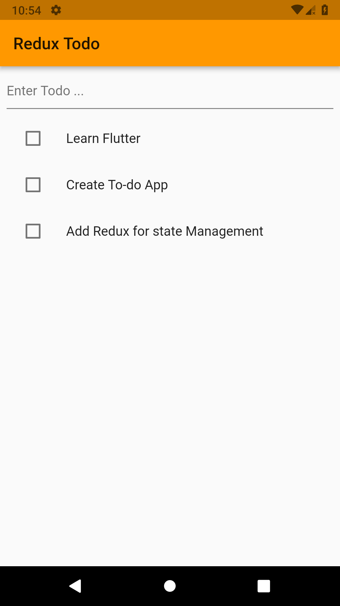
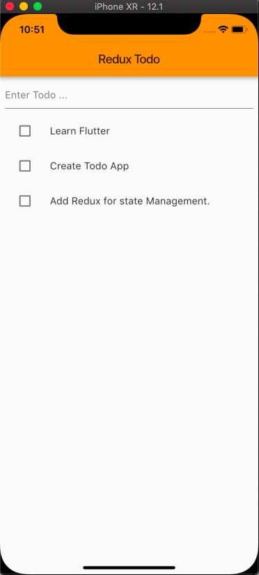

# Redux Todo

Sample Flutter Application Created Using Redux.
Redux is used for state management and single data location.

# Plugins Used:

- [Flutter_Redux](https://goo.gl/9Fjs8o)
- [Redux](https://goo.gl/QVmGAW)

# SnapShots:

## Android

## IOS

Cheers.🍺 ⚡ Keep Coding️ 🤟
